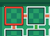
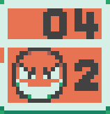

# Voltorb Flip Solver

An autonomous Voltorb Flip game solver that reads screen info to get the current state of the game and calculates the best moves accordingly.

# Application Layout

## Controls

At the bottom of the screen are several different buttons to control the program's behavior
- **Continuous Capture Mode** - if enabled, the application will continuously capture screen information and automatically update the board accordingly
- **Calibrate** - when clicked, the application will scan the screen, looking for an open game of voltorb flip and store its positional information for later use (top-left square on the board must not be flipped yet for proper calibration)
- **Capture Screen** - if Continuous Capture Mode is disabled, use this button to capture screen information
- **Current Level** - use the dropdown to select which level of the game you are currently on, or use the arrow button to increment it

## Board

The onscreen board will show which cards have already been flipped as well as all possible values for unflipped cards. Cards that cannot possibly hold a voltorb will be surrounded by a green border.

# Game Strategy

This application uses a number of general rules to calculate the possible values at each location ([basic rules](https://www.dragonflycave.com/johto/voltorb-flip))
1. If a line has 0 voltorbs, remove ***voltorb*** as a possibility
2. If a line has 5 voltorbs, leave ***voltorb*** as the only possibility
3. If a line has 4 voltorbs, the only possibilities will be ***voltorb*** or the line's ***point total***
4. If the number of voltorbs + the line's remaining point total = the number of squares left, the only possibilities are ***1*** or ***voltorb*** (Ex: a row with 1 voltorb and a point total of 4 can only have ***1s*** or ***voltorbs***)
5. If the number of voltorbs + the line's remaining point total = the number of squares left + 1, there can be ***voltorbs***, ***1s***, or ***2s***, but no ***3s***
6. If the line's remaining point total >= 2 + (the number of squares remaining - 1) * 3, the point total is too high for ***1s*** to be a possibility
7. This rule has 3 parts to it. Let p = the total number of points left in a line, f = the number of free squares remaining (i.e. the number of squares left - the number of voltorbs)
    - If p < 2f, there are at minimum 2f - p ***1s***
    - If p > 2f, there are at minimum p - 2f ***3s***
    - If the parity of p is different from the parity of f (p % 2 != f % 2), there is a single ***2*** in the line
8. After calculating these more basic rules, the application then analyzes the possible combinations of point values that sum to the needed total value to figure out which squares MUST hold points in order to achieve the desired sum (i.e. a line with a total of 6 could be either 1, 1, 2, 2 or 1, 1, 1, 3). Using an example from [DragonflyCave](https://www.dragonflycave.com/johto/voltorb-flip),
 
there must be either 2 twos or 1 three, and in either case, the 4th card must be used as a ***2*** or a ***3***. Therefore, it cannot possibly be a ***voltorb*** or a ***1***.
9. If the number of potential ***2s*** or ***3s*** on the board <= the total number of ***2s*** or ***3s*** for [each possible board in the given level](https://bulbapedia.bulbagarden.net/wiki/Voltorb_Flip#:~:text=contain%20more%20Voltorbs%3A-,Level,-%C3%972s), they are all guaranteed to be ***2s*** or ***3s***. This is useful during the endgame in which all other rules have already exhausted their use.

Throughout the evaluation of these rules, the application constantly keeps track of which of the [predetermined boards for the level](https://bulbapedia.bulbagarden.net/wiki/Voltorb_Flip#:~:text=contain%20more%20Voltorbs%3A-,Level,-%C3%972s) are possible at any given point. It uses this informaiton to determine which combinations of point values are possible in each line, providing vital information in endgame states.

# Screen Capture/Board Detection

## Locating the board onscreen

This application uses incremental pixel detection to locate the top-left pixel of the game board by comparing its color to a reference image.

## Verifying that we have actually found the board

For the sake of performance, the application doesn't try to scan the entire board whenever it has found a pixel of the correct color. It instead follows several verification steps of increasing complexity.

### Surroundings Verification

First, the application looks at the pixels above, below, and to the sides to verify that they are also the correct colors. However, to compensate for varying screen resolutions, it will look several pixels to the right and below to make sure that we are not missing anything.

### Top Row Verification

The previous verification will rule out most false positives, but now we have to verify that we have found the exact top-left pixel. To do this, the application scans the entire top row of the detected card by procedurally comparing it to the top row of the reference image.

Once a match is found, the application uses the length of the image on screen to calculate the relative scale of the entire board compared to the reference images. This scale will be used for all following calculations, so this step is vital for detecting the rest of the board.

### Whole Card Verification

At this point, we have the relative scale of the screen, so the application simply calculates the position and size of the top-left card, takes a screenshot using those parameters, and [compares](#image-comparison) it to the reference images below.

### Board Scanning

Now that we have found the top-left corner of the game board, we can now begin scanning for flipped tiles and line information. Using the screen's relative scale, the application incrementally checks each card on the board and compares them to the flipped card reference images.

Then, the application checks the voltorb cards at the edge of the board and scans them for the numbers contained within. Since the numbers are at the exact same positions within each card, we can simply check those positions and [compare](#image-comparison) them with all number images to determine their values.

 etc

## Image Comparison
Since this application is designed to work for devices of varying aspect ratios, it resizes all screenshots based on the calculated relative scale. However, [System.Drawing](https://learn.microsoft.com/en-us/dotnet/api/system.drawing?view=dotnet-plat-ext-8.0) built-in resizing is rarely pixel perfect, which causes problems for pixel-by-pixel approaches. Some other factors that may cause screenshots to slightly differ from the reference images may be monitor brightness, saturation, color balance, or screen tearing. 

To reconcile these potential issues, we must implement some sort of imperfection tolerance into our image comparison algorithm. Here is the algorithm I came up with after contemplating this issue:

- First, run [ImageComparer.Compare](https://learn.microsoft.com/en-us/dotnet/api/microsoft.visualstudio.testtools.uitesting.imagecomparer.compare?view=visualstudiosdk-2017&redirectedfrom=MSDN#overloads) on the image. If this works, we're done. YIPPEE!! :D
- Otherwise, loop through every pixel in the difference image provided by [ImageComparer.Compare](https://learn.microsoft.com/en-us/dotnet/api/microsoft.visualstudio.testtools.uitesting.imagecomparer.compare?view=visualstudiosdk-2017&redirectedfrom=MSDN#overloads), checking to see if the pixel color is within tolerance.
- If the pixel color is outside tolerance, use a Breadth-First Search (BFS) based algorithm to find the size of all "islands" of non-tolerated pixels.
- If any "island" is larger than our tolerance, the image is not similar enough to the reference to be considered "equal"

This algorithm works great for most use cases as the tolerance can be edited as needed depending on how precise our image comparison needs to be. However, for distinguishing between numbers found on cards, the background color of each card is different, so we can't just input it directly into the image comparison algorithm. 

Before comparing with reference images, we need to remove the background color from our internal screenshot. We do this by first finding the exact shade of black used for this specific number and then clear out all pixels that are a different color.